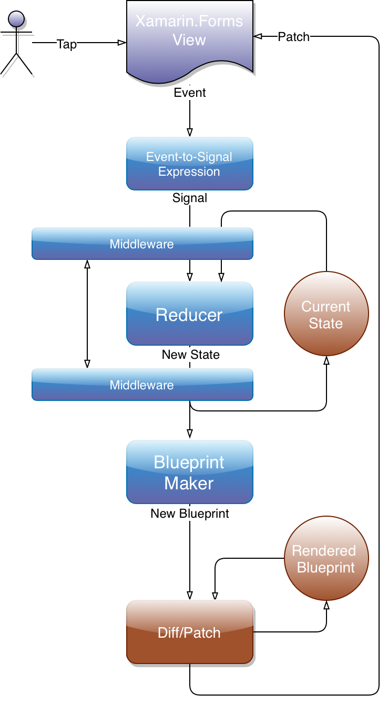

## Introduction

Laconic is an MVU library for writing apps with Xamarin.Forms in
 plain C#, using React + Redux approach.

Code written with Laconic is:

- **Declarative**: Your code simply declares how the
app views should look, given the current state of the app, 
and Laconic figures out the most efficient way of updating 
the actual views.

- **Functional**: Laconic gently pushes you towards functional programming,
with a strong emphasis on immutable state and pure functions. 
Code that is written in this style is easier to test, debug, and understand.

- **Familiar**: Code that uses Laconic consists
mostly of collection and property initializers, LINQ and switch expressions.
No DSL, no new semantics. The API is very similar to the API of Xamarin.Forms.

## Key Concepts

<div style="max-width:369px;max-height:669px;">
    
</div>

_(Blue elements is the app code, usually in the form of pure functions; middleware is optional)_

### State

Everything your app displays or manipulates should be kept in a single POCO. 
There are no special requirements for the state, but please try to
make it immutable.

### Blueprints

Blueprints are _virtual_ representations of app views, 
calculated from the current state by your code.
They are super-lightweight and can be effortlessly 
created thousands of times per second. This is what
allows Laconic to be declarative.

### Signals

In Laconic based apps signals are a mechanism for reacting to changes
in the app. Signals are tiny objects that usually carry a payload.

### Reducer

Reducer is a pure function that receives the current state, a signal,
and calculates the new state. In most cases the reducer is a big
`switch` expression.

### Binder

Binder is what ties State and Reducer together, and provides methods for creating
actual Xamarin.Forms views using Blueprint maker functions supplied by you. 

### Example

Here's a complete working app:

``` csharp
using System;
using xf = Xamarin.Forms;

namespace Laconic.Demo
{
    public class App : xf.Application
    {
        static ContentPage Counter(int state) => new ContentPage { Content = new StackLayout
        {
            Padding = 50,
            ["lbl"] = new Label
            {
                Text = $"You clicked {state} times",
                FontSize = 30,
                FontAttributes = xf.FontAttributes.Bold,
                VerticalOptions = xf.LayoutOptions.CenterAndExpand,
                HorizontalOptions = xf.LayoutOptions.Center
            },
            ["btn"] = new Button
            {
                Text = "Click Me",
                Clicked = () => new Signal("inc"),
                TextColor = xf.Color.White,
                FontSize = 20,
                BackgroundColor = xf.Color.Coral,
                BorderColor = xf.Color.Chocolate,
                BorderWidth = 3,
                CornerRadius = 10,
                HorizontalOptions = xf.LayoutOptions.Center,
                Padding = new xf.Thickness(30, 0)
            }
        }};

        static int Reducer(int state, Signal signal) => signal.Payload switch
        {
            "inc" => state + 1,
            "dec" => throw new NotImplementedException(), // Left as an exercise for the reader
            _ => state
        };

        readonly Binder<int> _binder;

        public App()
        {

            _binder = Binder.Create(0, Reducer);
            MainPage = _binder.CreatePage(Counter);
        }
    }
}
```

For more sample code check the Demo app in this repository.

## Other Examples

[KickassUI.Banking](https://github.com/shirshov/KickassUI.Banking) -- a complete port
to Laconic of a sample app (UI only) by Steven Thewissen.

[My Contacts](https://github.com/shirshov/app-contacts) -- a step by step porting
to Laconic of a sample app by Xamarin.


[](https://gitter.im/laconiclib/community?utm_source=badge&utm_medium=badge&utm_campaign=pr-badge&utm_content=badge)

